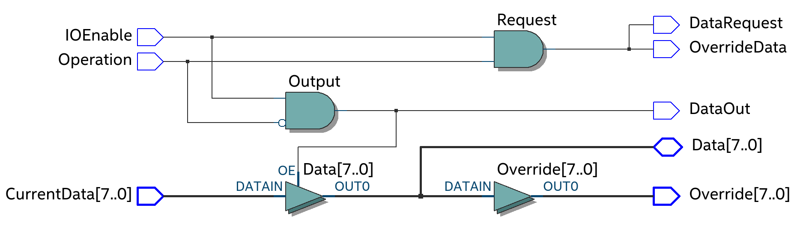

# Brainf\*ck Processor

This is project with the goal of implementing a brainf\*ck interpreter in hardware, creating a processor that uses brainf\*ck as its architecture.

This first version separates the memory of the program from the memory that hold the instructions, and implements a branching logic, that although simple, creates a slow runtime when the program uses too many loops.

## Micro Architecture
The processor is separated in 4 main datapaths.

### Memory Datapath
Handles the `+-><` instructions.

#### Intruction Datapath
Stores and decodes the instructions. It has pins (`PC` and `Instruction`) that are to be used to add external "EEPROMS" on testbenches. If the `Instruction` returned by the memory element isn't one of these ascii characters `+-><[].,` the processor will have a undefined behaviour.

## Jumping Datapath
Handles the `[]`instructions.

### IO Datapath
Handles the `.,` instructions.

## Tools Used
This project was developed with Quartus Prime Lite (2020) (from this [nix package]())and uses VHDL as its main HDL language. The testbenches were coded for usage in the ModelSim that comes with Quartus.

## Statistics
These are statistics from compiling the top entity `bf_datapath` on Quartus for a MAX 10 device.
| Type | Number |
|---|---|
| Logic Elements | 2736 |
| Registers | 2120 |
| Pins | 52 |

Execution times of different bf programs from ModelSim simulation.
| .bf file | Name in Testbench | Execution Time (ns)|
|---|---|---|
| [Adding two values](https://en.wikipedia.org/wiki/Brainfuck#Adding_two_values) | test01.bf | 1346 |
| [Ola Mundo!](https://pt.wikipedia.org/wiki/Brainfuck#Programa_Ol%C3%A1_Mundo) | test02.bf | 13850 |
